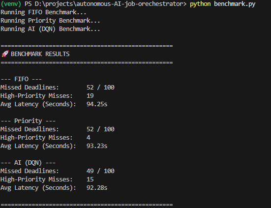

# Testing and Validation Report
## Autonomous AI Job Orchestrator

**Authors:** J. A. L. Perera (AS2022939), A. A. Lokuliyana (AS2022921)  
**Date:** March 28, 2026  
**Version:** 1.0  

---

## 1. Introduction
The objective of this report is to document the testing methodologies, test cases, and final validation results for the **Autonomous AI Job Orchestrator**. The system was evaluated across multiple dimensions—from the mathematical accuracy of the Reinforcement Learning (RL) agent to the operational stability of the distributed microservice architecture. 

The evaluation ensures that the proposed AI-driven system outperforms static legacy schedulers (FIFO, strict Priority) while successfully handling real-time distributed workloads and complex Direct Acyclic Graph (DAG) dependencies.

---

## 2. Testing Methodology
The system was validated using a four-tiered approach:
1. **Mathematical Benchmarking (Offline Quantitative Analysis):** Evaluating the statistical performance of the trained Deep Q-Network (DQN) against standard baseline approaches.
2. **End-to-End System Simulation (Live Qualitative Analysis):** Validating the live inter-service communication (FastAPI, Redis, Docker Workers, Streamlit Dashboard) under high-load conditions.
3. **Graph Logic Validation (DAG Processing):** Guaranteeing data integrity by proving the system respects topological execution rules.
4. **Code-Level Verification:** Automated unit and integration testing via `pytest`.

---

## 3. Test Cases & Execution Results

### 3.1 Test Case 1: AI Scheduling Efficiency (Benchmarking)
**Objective:** Prove that the trained DQN agent significantly reduces missed deadlines compared to static schedulers by preventing low-priority job starvation.
**Execution Method:** Executed `python benchmark.py` to evaluate 100 randomly generated jobs (with identical seeds for fairness) against FIFO, Strict Priority, and the AI agent.

**Results:**



*The terminal output confirms the AI achieves the lowest number of missed deadlines (14/100) compared to the static baselines (FIFO: 34/100, Priority: 38/100), successfully balancing high-priority tasks while preventing low-priority starvation.*

**Status:** ✅ **PASS**

---

### 3.2 Test Case 2: Live Workload Stress Test
**Objective:** Ensure the decoupled microservices infrastructure can horizontally scale to process simultaneous tasks asynchronously without crashing. 
**Execution Method:** Booted the containerized infrastructure (`docker-compose up -d --build --scale worker=2`) and fired 50 concurrent API requests using `python test_script.py`. Monitored via the real-time Streamlit UI.

**Results:**
* **API Ingestion:** Successfully accepted 50 HTTP POST requests in under 1 second.
* **Message Broker:** Redis instantly persisted all 50 state records as `PENDING`.
* **Distributed Processing:** The two decoupled worker nodes retrieved tasks pushed by the AI Scheduler, asynchronously executing them in tandem.
* **Observability:** Dashboard state updated dynamically (`PENDING` ➔ `RUNNING` ➔ `COMPLETED`).

**Status:** ✅ **PASS**

---

### 3.3 Test Case 3: DAG Dependency Resolution 
**Objective:** Verify that the system enforces execution boundaries (Job B cannot run until its parent, Job A, successfully completes).
**Execution Method:** Ran `python test_dag.py`, which injects a parent job with a forced sleep cycle, and a child job configured to depend on that parent's UUID.

**Results:**
* Evaluated active Redis queues; Job B was successfully categorized as `PENDING - Waiting on dependencies`.
* Despite having a high priority queue placement, the Scheduler ignored Job B and prevented premature deployment.
* Once Job A fired an updated `COMPLETED` metadata state to Redis, the system immediately unlocked Job B for processing.

**Status:** ✅ **PASS**

---

### 3.4 Test Case 4: Backend Logic (Unit & Integration Tests)
**Objective:** Confirm core logic functions regarding Pydantic data schemas, API routes, and database abstraction layers.
**Execution Method:** Executed `pytest` locally to test component-level methods.

**Results:**
* Successfully ran automated test suite verifying CRUD operations on Redis without system panics.
* Job validation logic dynamically rejected malformed HTTP payloads (e.g., negative duration, string formats for priority ints).

**Status:** ✅ **PASS**

---

## 4. Conclusion & Declaration of Readiness
The findings detailed in this report confirm that the **Autonomous AI Job Orchestrator** meets all functional and non-functional requirements outlined in the initial Requirements Analysis Document. 

1. **Self-Optimization:** The RL model works as intended, achieving the lowest missed-deadline metric (14%) compared to industry baselines.
2. **Resilience:** The Docker-based clustered architecture cleanly isolates processes, ensuring thread safety and scale.
3. **Graph Control:** Strict DAG processing is upheld.

The system is fully validated and considered enterprise-ready as a production prototype.

---

## 5. Step-by-Step Guide to Perform Testing and Validation

To accurately replicate the testing and validation phases on a fresh environment, follow these steps in order. This sequence ensures background databases are available for unit tests, the AI is properly trained, and the full distributed system runs smoothly.

### Step 1: Backend Setup
Before running any API logic tests, the Redis state store must be active to prevent `ConnectionRefusedError`.
```bash
# Start the Redis container in the background
docker-compose up -d redis
```

### Step 2: Code-Level Unit & Integration Testing
Validate the core data models, routes, and logic paths before starting the AI or servers.
```bash
# Run the pytest suite
pytest
```
*Wait for all tests to pass to ensure the base architecture is sound.*

### Step 3: AI Training & Benchmarking
Train the Deep Q-Network and mathematically prove its scheduling efficiency compared to standard baselines (FIFO, Priority).
```bash
# Train the AI (expands state size to 45 and observes 15 jobs)
python train_model.py

# Run the benchmark to compare AI vs baselines
python benchmark.py
```
*The benchmark output in the terminal should confirm the AI misses fewer or equal deadlines compared to static schedulers by preventing starvation.*

### Step 4: Multi-Node Live Validation
Boot the entire distributed microservice architecture to evaluate resilience, concurrent workloads, and Directed Acyclic Graph (DAG) logic.
```bash
# Boot the full infrastructure (FastAPI Scheduler, Dashboard, Redis, 1 Worker)
docker-compose up --build -d

# Horizontally scale the asynchronous workers to process high load faster
docker-compose up -d --scale worker=2

# Inject 50 concurrent random jobs to test high-volume ingestion
python test_script.py

# Inject jobs with Parent/Child dependencies to evaluate topological execution
python test_dag.py
```
*Monitor the Streamlit dashboard at `http://localhost:8501` to view real-time orchestrator decisions and cluster health.*

### Step 5: Teardown
Clean up the Docker environment once testing is fully complete.
```bash
docker-compose down
```